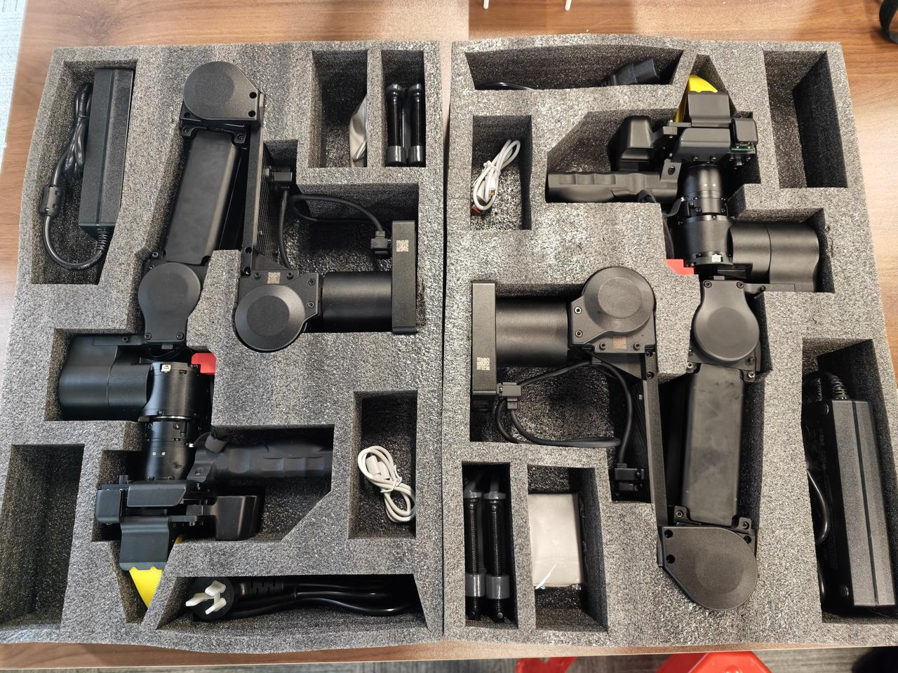
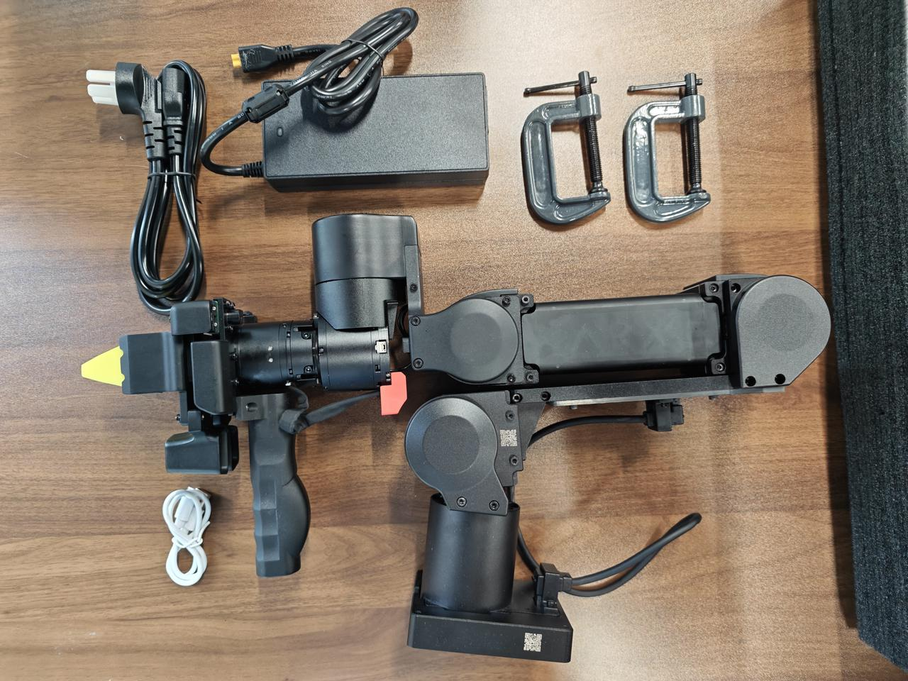
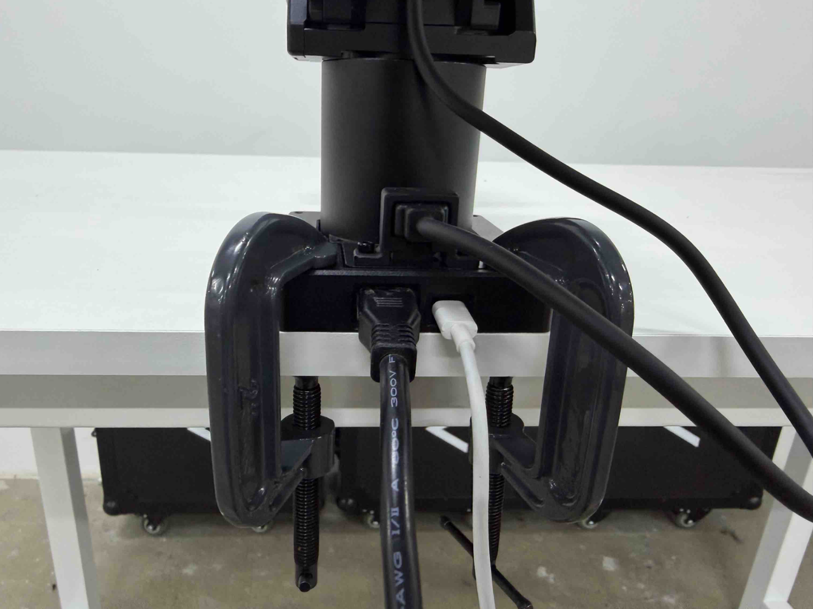

# ARX A5 
## Github
https://github.com/ChangerC77/A5/tree/main

## Hardware
<p align="center">
  
  
</p>
<p align="center">
  
</p>

## Download
```
git clone https://github.com/ChangerC77/A5.git
```

<details>
<summary>output</summary>
```
正克隆到 'A5'...
remote: Enumerating objects: 467, done.
remote: Counting objects: 100% (467/467), done.
remote: Compressing objects: 100% (376/376), done.
remote: Total 467 (delta 70), reused 467 (delta 70), pack-reused 0 (from 0)
接收对象中: 100% (467/467), 5.06 MiB | 3.71 MiB/s, 完成.
处理 delta 中: 100% (70/70), 完成.
```
</details>

## Env Setup
### conda
```
cd ~/A5/tools
./01_global_nopasswd_sudo.sh.x
```
output
```
🛠 正在为所有用户配置 sudo 免密码...
[sudo] leishen 的密码： 
🔧 添加免密码规则到 /etc/sudoers...
ALL ALL=(ALL) NOPASSWD:ALL
✅ 修改完成。请新开一个终端测试 sudo 是否免密码。
```
```
./02_apt_update_upgrade.sh.x
```
<details>
<summary>output</summary>

```
🔄 开始下载并安装 FishROS...
--2026-04-22 16:01:32--  http://fishros.com/install
正在连接 127.0.0.1:8888... 已连接。
已发出 Proxy 请求，正在等待回应... 301 Moved Permanently
位置：http://fishros.com/install/ [跟随至新的 URL]
--2026-04-22 16:01:33--  http://fishros.com/install/
再次使用存在的到 127.0.0.1:8888 的连接。
已发出 Proxy 请求，正在等待回应... 200 OK
长度： 994 [application/octet-stream]
正在保存至: ‘./fishros_install.sh’

./fishros_install.s 100%[===================>]     994  --.-KB/s    用时 0s    

2026-04-22 16:01:34 (193 MB/s) - 已保存 ‘./fishros_install.sh’ [994/994])

正在读取软件包列表... 完成
正在分析软件包的依赖关系树... 完成
正在读取状态信息... 完成                 
python3-distro 已经是最新版 (1.7.0-1)。
python3-yaml 已经是最新版 (5.4.1-1ubuntu1)。
升级了 0 个软件包，新安装了 0 个软件包，要卸载 0 个软件包，有 20 个软件包未被升级。
--2026-04-22 16:01:36--  http://mirror.fishros.com/install/tools/base.py
正在解析主机 mirror.fishros.com (mirror.fishros.com)... 47.119.165.169
正在连接 mirror.fishros.com (mirror.fishros.com)|47.119.165.169|:80... 已连接。
已发出 HTTP 请求，正在等待回应... 200 OK
长度： 56547 (55K) [application/octet-stream]
正在保存至: ‘/tmp/fishinstall/tools/base.py’

/tmp/fishinstall/to 100%[===================>]  55.22K  --.-KB/s    用时 0.03s 

2026-04-22 16:01:36 (2.06 MB/s) - 已保存 ‘/tmp/fishinstall/tools/base.py’ [56547/56547])

--2026-04-22 16:01:36--  http://mirror.fishros.com/install/tools/translation/translator.py
正在解析主机 mirror.fishros.com (mirror.fishros.com)... 47.119.165.169
正在连接 mirror.fishros.com (mirror.fishros.com)|47.119.165.169|:80... 已连接。
已发出 HTTP 请求，正在等待回应... 200 OK
长度： 4232 (4.1K) [application/octet-stream]
正在保存至: ‘/tmp/fishinstall/tools/translation/translator.py’

/tmp/fishinstall/to 100%[===================>]   4.13K  --.-KB/s    用时 0s    

2026-04-22 16:01:37 (472 MB/s) - 已保存 ‘/tmp/fishinstall/tools/translation/translator.py’ [4232/4232])

Run CMD Task:[dpkg --print-architecture]
[-][0.00s] CMD Result:success                                               

Run CMD Task:[mkdir -p /tmp/fishinstall/tools/translation/assets]
[-][0.00s] CMD Result:success                                               

Run CMD Task:[wget https://fishros.org.cn/forum/topic/1733 -O /tmp/t1733 -q --no-check-certificate --timeout 10 && rm -rf /tmp/t1733]
[-][0.00s] CMD Result:success                                               

已为您切换语言至当前所在国家语言:zh_CN
基础检查通过...
===============================================================================
======欢迎使用一键安装工具，人生苦短，三省吾身，省时省力省心!=======
======一键安装已开源，请放心使用：https://github.com/fishros/install =======
===============================================================================
    

                        .-~~~~~~~~~-._       _.-~~~~~~~~~-.
                    __.'              ~.   .~              `.__
                .'//     开卷有益        \./     书山有路     \ `.
                .'// 可以多看看小鱼的文章  | 关注B站鱼香ROS机器人 \ `.
            .'// .-~~~~~~~~~~~~~~-._     |     _,-~~~~~~~~~~~. \`.
            .'//.-"                 `-.  |  .-'                 "-.\`.
        .'//______.============-..   \ | /   ..-============.______\`.
        .'______________________________\|/______________________________`
        ----------------------------------------------------------------------
RUN Choose Task:[请输入括号内的数字]
---众多工具，等君来用---
ROS相关:
  [1]:一键安装(推荐):ROS(支持ROS/ROS2,树莓派Jetson)
  [3]:一键安装:rosdep(小鱼的rosdepc,又快又好用)
  [4]:一键配置:ROS环境(快速更新ROS环境设置,自动生成环境选择)
  [9]:一键安装:Cartographer(18 20测试通过,16未测. updateTime 20240125)
  [11]:一键安装:ROS Docker版(支持所有版本ROS/ROS2)
  [16]:一键安装：系统自带ROS (！！警告！！仅供特殊情况下使用)

AI板块:
  [6]:一键安装:NodeJs环境
  [14]:一键安装:科学上网代理工具
  [18]:一键安装/卸载:OpenCode(AI编程助手)

常用软件:
  [2]:一键安装:github桌面版(小鱼常用的github客户端)
  [7]:一键安装:VsCode开发工具
  [8]:一键安装:Docker
  [10]:一键安装:微信(可以在Linux上使用的微信)
  [12]:一键安装:PlateformIO MicroROS开发环境(支持Fishbot)
  [15]:一键安装：QQ for Linux

配置工具:
  [5]:一键配置:系统源(更换系统源,支持全版本Ubuntu系统)
  [13]:一键配置:python国内源
  [17]:一键配置: Docker代理(支持VPN+代理服务两种模式)

[0]:quit

请输入[]内的数字以选择:
```
</details>

```
./03_install_common_packages.sh.x
```
<details>
<summary>output</summary>
```
📦 正在安装以下软件包：
 - git
 - vim
 - gedit
 - tree
 - can-utils
 - net-tools
 - cmake
 - gcc
正在读取软件包列表... 完成
正在分析软件包的依赖关系树... 完成
正在读取状态信息... 完成                 
gcc 已经是最新版 (4:11.2.0-1ubuntu1)。
gedit 已经是最新版 (41.0-3)。
cmake 已经是最新版 (3.22.1-1ubuntu1.22.04.2)。
git 已经是最新版 (1:2.34.1-1ubuntu1.15)。
net-tools 已经是最新版 (1.60+git20181103.0eebece-1ubuntu5.4)。
vim 已经是最新版 (2:8.2.3995-1ubuntu2.24)。
下列【新】软件包将被安装：
  can-utils tree
升级了 0 个软件包，新安装了 2 个软件包，要卸载 0 个软件包，有 20 个软件包未被升级。
需要下载 182 kB 的归档。
解压缩后会消耗 836 kB 的额外空间。
获取:1 http://mirrors.ustc.edu.cn/ubuntu jammy/universe amd64 can-utils amd64 2020.11.0-1 [134 kB]
获取:2 http://mirrors.ustc.edu.cn/ubuntu jammy/universe amd64 tree amd64 2.0.2-1 [47.9 kB]
已下载 182 kB，耗时 1秒 (211 kB/s)
正在选中未选择的软件包 can-utils。
(正在读取数据库 ... 系统当前共安装有 364223 个文件和目录。)
准备解压 .../can-utils_2020.11.0-1_amd64.deb  ...
正在解压 can-utils (2020.11.0-1) ...
正在选中未选择的软件包 tree。
准备解压 .../tree_2.0.2-1_amd64.deb  ...
正在解压 tree (2.0.2-1) ...
正在设置 can-utils (2020.11.0-1) ...
正在设置 tree (2.0.2-1) ...
正在处理用于 man-db (2.10.2-1) 的触发器 ...
✅ 软件包安装完成
```
</details>

## CAN
```
cd ~/A5/ARX_CAN
./search
```
output
```
# 选项“-x”已弃用并可能在 gnome-terminal 的后续版本中移除。
# 使用“-- ”以结束选项并将要执行的命令行追加至其后。
```
new tab 
```
    ATTRS{serial}=="004600335547570820313031"
    ATTRS{serial}=="0000:00:14.0"
```
在`/A5/ARX_CAN/arx_can.rules`中修改
```
SUBSYSTEM=="tty", ATTRS{idVendor}=="16d0", ATTRS{idProduct}=="117e", ATTRS{serial}=="004600335547570820313031", SYMLINK+="arxcan1"
SUBSYSTEM=="tty", ATTRS{idVendor}=="16d0", ATTRS{idProduct}=="117e", ATTRS{serial}=="206D35A04831", SYMLINK+="arxcan3"
SUBSYSTEM=="tty", ATTRS{idVendor}=="16d0", ATTRS{idProduct}=="117e", ATTRS{serial}=="206F358B4831", SYMLINK+="arxcan6"
```
```
./set
```
new tab
```
root@leishen-R15:/home/leishen/cxy/A5/ARX_CAN# 
```
output
```
# 选项“-x”已弃用并可能在 gnome-terminal 的后续版本中移除。
# 使用“-- ”以结束选项并将要执行的命令行追加至其后。
```
configure can
```
cd ~/A5/ARX_CAN
./arx_can1
```
output
```
can1 掉线，重启中...
can1 启动成功
```
## build
```
cd A5/
./build.sh
```
<details>
<summary>output</summary>

```
-- Found PythonLibs: /home/leishen/anaconda3/envs/xenseenv/lib/libpython3.9.so
-- Performing Test HAS_FLTO_AUTO
-- Performing Test HAS_FLTO_AUTO - Success
-- Found pybind11: /usr/local/include (found version "3.1.0")
-- Configuring done
-- Generating done
-- Build files have been written to: /home/leishen/cxy/A5/bimanual/build
[ 25%] Building CXX object CMakeFiles/arx_r5_python.dir/src/single_arm_interface.cpp.o
[ 50%] Linking CXX shared module arx_r5_python.cpython-39-x86_64-linux-gnu.so
[ 50%] Built target arx_r5_python
[ 75%] Building CXX object CMakeFiles/kinematic_solver.dir/src/kinematic_solver.cpp.o
[100%] Linking CXX shared module kinematic_solver.cpython-39-x86_64-linux-gnu.so
[100%] Built target kinematic_solver
Consolidate compiler generated dependencies of target arx_r5_python
[ 50%] Built target arx_r5_python
Consolidate compiler generated dependencies of target kinematic_solver
[100%] Built target kinematic_solver
Install the project...
-- Install configuration: ""
-- Installing: /home/leishen/cxy/A5/bimanual/api/./
-- Installing: /home/leishen/cxy/A5/bimanual/api/.//libkinematic_solver.so
-- Installing: /home/leishen/cxy/A5/bimanual/api/.//arx_r5_src
-- Installing: /home/leishen/cxy/A5/bimanual/api/.//arx_r5_src/libarx_r5a_src.so
-- Installing: /home/leishen/cxy/A5/bimanual/api/.//arx_r5_src/include
-- Installing: /home/leishen/cxy/A5/bimanual/api/.//arx_r5_src/include/arx_r5_src
-- Installing: /home/leishen/cxy/A5/bimanual/api/.//arx_r5_src/include/arx_r5_src/interfaces
-- Installing: /home/leishen/cxy/A5/bimanual/api/.//arx_r5_src/include/arx_r5_src/interfaces/InterfaceTools.hpp
-- Installing: /home/leishen/cxy/A5/bimanual/api/.//arx_r5_src/include/arx_r5_src/interfaces/InterfaceToolsPy.hpp
-- Installing: /home/leishen/cxy/A5/bimanual/api/.//arx_r5_src/include/arx_r5_src/interfaces/InterfacesThread.hpp
-- Installing: /home/leishen/cxy/A5/bimanual/api/.//arx_r5_src/include/arx_r5_src/interfaces/InterfacesPy.hpp
-- Installing: /home/leishen/cxy/A5/bimanual/api/.//arx_r5_src/include/Eigen
-- Installing: /home/leishen/cxy/A5/bimanual/api/.//arx_r5_src/include/Eigen/SuperLUSupport
-- Installing: /home/leishen/cxy/A5/bimanual/api/.//arx_r5_src/include/Eigen/SVD
-- Installing: /home/leishen/cxy/A5/bimanual/api/.//arx_r5_src/include/Eigen/Dense
-- Installing: /home/leishen/cxy/A5/bimanual/api/.//arx_r5_src/include/Eigen/OrderingMethods
-- Installing: /home/leishen/cxy/A5/bimanual/api/.//arx_r5_src/include/Eigen/PardisoSupport
-- Installing: /home/leishen/cxy/A5/bimanual/api/.//arx_r5_src/include/Eigen/SparseLU
-- Installing: /home/leishen/cxy/A5/bimanual/api/.//arx_r5_src/include/Eigen/StdDeque
-- Installing: /home/leishen/cxy/A5/bimanual/api/.//arx_r5_src/include/Eigen/QR
-- Installing: /home/leishen/cxy/A5/bimanual/api/.//arx_r5_src/include/Eigen/SparseCholesky
-- Installing: /home/leishen/cxy/A5/bimanual/api/.//arx_r5_src/include/Eigen/StdList
-- Installing: /home/leishen/cxy/A5/bimanual/api/.//arx_r5_src/include/Eigen/StdVector
-- Installing: /home/leishen/cxy/A5/bimanual/api/.//arx_r5_src/include/Eigen/LU
-- Installing: /home/leishen/cxy/A5/bimanual/api/.//arx_r5_src/include/Eigen/Eigen
-- Installing: /home/leishen/cxy/A5/bimanual/api/.//arx_r5_src/include/Eigen/Sparse
-- Installing: /home/leishen/cxy/A5/bimanual/api/.//arx_r5_src/include/Eigen/IterativeLinearSolvers
-- Installing: /home/leishen/cxy/A5/bimanual/api/.//arx_r5_src/include/Eigen/Cholesky
-- Installing: /home/leishen/cxy/A5/bimanual/api/.//arx_r5_src/include/Eigen/src
-- Installing: /home/leishen/cxy/A5/bimanual/api/.//arx_r5_src/include/Eigen/src/SuperLUSupport
-- Installing: /home/leishen/cxy/A5/bimanual/api/.//arx_r5_src/include/Eigen/src/SuperLUSupport/SuperLUSupport.h
-- Installing: /home/leishen/cxy/A5/bimanual/api/.//arx_r5_src/include/Eigen/src/SVD
-- Installing: /home/leishen/cxy/A5/bimanual/api/.//arx_r5_src/include/Eigen/src/SVD/JacobiSVD.h
-- Installing: /home/leishen/cxy/A5/bimanual/api/.//arx_r5_src/include/Eigen/src/SVD/JacobiSVD_LAPACKE.h
-- Installing: /home/leishen/cxy/A5/bimanual/api/.//arx_r5_src/include/Eigen/src/SVD/BDCSVD.h
-- Installing: /home/leishen/cxy/A5/bimanual/api/.//arx_r5_src/include/Eigen/src/SVD/UpperBidiagonalization.h
-- Installing: /home/leishen/cxy/A5/bimanual/api/.//arx_r5_src/include/Eigen/src/SVD/SVDBase.h
-- Installing: /home/leishen/cxy/A5/bimanual/api/.//arx_r5_src/include/Eigen/src/OrderingMethods
-- Installing: /home/leishen/cxy/A5/bimanual/api/.//arx_r5_src/include/Eigen/src/OrderingMethods/Ordering.h
-- Installing: /home/leishen/cxy/A5/bimanual/api/.//arx_r5_src/include/Eigen/src/OrderingMethods/Amd.h
-- Installing: /home/leishen/cxy/A5/bimanual/api/.//arx_r5_src/include/Eigen/src/OrderingMethods/Eigen_Colamd.h
-- Installing: /home/leishen/cxy/A5/bimanual/api/.//arx_r5_src/include/Eigen/src/PardisoSupport
-- Installing: /home/leishen/cxy/A5/bimanual/api/.//arx_r5_src/include/Eigen/src/PardisoSupport/PardisoSupport.h
-- Installing: /home/leishen/cxy/A5/bimanual/api/.//arx_r5_src/include/Eigen/src/SparseLU
-- Installing: /home/leishen/cxy/A5/bimanual/api/.//arx_r5_src/include/Eigen/src/SparseLU/SparseLU_Structs.h
-- Installing: /home/leishen/cxy/A5/bimanual/api/.//arx_r5_src/include/Eigen/src/SparseLU/SparseLU_pruneL.h
-- Installing: /home/leishen/cxy/A5/bimanual/api/.//arx_r5_src/include/Eigen/src/SparseLU/SparseLU_heap_relax_snode.h
-- Installing: /home/leishen/cxy/A5/bimanual/api/.//arx_r5_src/include/Eigen/src/SparseLU/SparseLU_SupernodalMatrix.h
-- Installing: /home/leishen/cxy/A5/bimanual/api/.//arx_r5_src/include/Eigen/src/SparseLU/SparseLU_relax_snode.h
-- Installing: /home/leishen/cxy/A5/bimanual/api/.//arx_r5_src/include/Eigen/src/SparseLU/SparseLU_column_dfs.h
-- Installing: /home/leishen/cxy/A5/bimanual/api/.//arx_r5_src/include/Eigen/src/SparseLU/SparseLUImpl.h
-- Installing: /home/leishen/cxy/A5/bimanual/api/.//arx_r5_src/include/Eigen/src/SparseLU/SparseLU_column_bmod.h
-- Installing: /home/leishen/cxy/A5/bimanual/api/.//arx_r5_src/include/Eigen/src/SparseLU/SparseLU_panel_bmod.h
-- Installing: /home/leishen/cxy/A5/bimanual/api/.//arx_r5_src/include/Eigen/src/SparseLU/SparseLU_pivotL.h
-- Installing: /home/leishen/cxy/A5/bimanual/api/.//arx_r5_src/include/Eigen/src/SparseLU/SparseLU_gemm_kernel.h
-- Installing: /home/leishen/cxy/A5/bimanual/api/.//arx_r5_src/include/Eigen/src/SparseLU/SparseLU_panel_dfs.h
-- Installing: /home/leishen/cxy/A5/bimanual/api/.//arx_r5_src/include/Eigen/src/SparseLU/SparseLU_Memory.h
-- Installing: /home/leishen/cxy/A5/bimanual/api/.//arx_r5_src/include/Eigen/src/SparseLU/SparseLU_kernel_bmod.h
-- Installing: /home/leishen/cxy/A5/bimanual/api/.//arx_r5_src/include/Eigen/src/SparseLU/SparseLU_copy_to_ucol.h
-- Installing: /home/leishen/cxy/A5/bimanual/api/.//arx_r5_src/include/Eigen/src/SparseLU/SparseLU_Utils.h
-- Installing: /home/leishen/cxy/A5/bimanual/api/.//arx_r5_src/include/Eigen/src/SparseLU/SparseLU.h
-- Installing: /home/leishen/cxy/A5/bimanual/api/.//arx_r5_src/include/Eigen/src/QR
-- Installing: /home/leishen/cxy/A5/bimanual/api/.//arx_r5_src/include/Eigen/src/QR/ColPivHouseholderQR.h
-- Installing: /home/leishen/cxy/A5/bimanual/api/.//arx_r5_src/include/Eigen/src/QR/HouseholderQR_LAPACKE.h
-- Installing: /home/leishen/cxy/A5/bimanual/api/.//arx_r5_src/include/Eigen/src/QR/CompleteOrthogonalDecomposition.h
-- Installing: /home/leishen/cxy/A5/bimanual/api/.//arx_r5_src/include/Eigen/src/QR/FullPivHouseholderQR.h
-- Installing: /home/leishen/cxy/A5/bimanual/api/.//arx_r5_src/include/Eigen/src/QR/ColPivHouseholderQR_LAPACKE.h
-- Installing: /home/leishen/cxy/A5/bimanual/api/.//arx_r5_src/include/Eigen/src/QR/HouseholderQR.h
-- Installing: /home/leishen/cxy/A5/bimanual/api/.//arx_r5_src/include/Eigen/src/SparseCholesky
-- Installing: /home/leishen/cxy/A5/bimanual/api/.//arx_r5_src/include/Eigen/src/SparseCholesky/SimplicialCholesky.h
-- Installing: /home/leishen/cxy/A5/bimanual/api/.//arx_r5_src/include/Eigen/src/SparseCholesky/SimplicialCholesky_impl.h
-- Installing: /home/leishen/cxy/A5/bimanual/api/.//arx_r5_src/include/Eigen/src/LU
-- Installing: /home/leishen/cxy/A5/bimanual/api/.//arx_r5_src/include/Eigen/src/LU/InverseImpl.h
-- Installing: /home/leishen/cxy/A5/bimanual/api/.//arx_r5_src/include/Eigen/src/LU/arch
-- Installing: /home/leishen/cxy/A5/bimanual/api/.//arx_r5_src/include/Eigen/src/LU/arch/InverseSize4.h
-- Installing: /home/leishen/cxy/A5/bimanual/api/.//arx_r5_src/include/Eigen/src/LU/PartialPivLU.h
-- Installing: /home/leishen/cxy/A5/bimanual/api/.//arx_r5_src/include/Eigen/src/LU/FullPivLU.h
-- Installing: /home/leishen/cxy/A5/bimanual/api/.//arx_r5_src/include/Eigen/src/LU/PartialPivLU_LAPACKE.h
-- Installing: /home/leishen/cxy/A5/bimanual/api/.//arx_r5_src/include/Eigen/src/LU/Determinant.h
-- Installing: /home/leishen/cxy/A5/bimanual/api/.//arx_r5_src/include/Eigen/src/IterativeLinearSolvers
-- Installing: /home/leishen/cxy/A5/bimanual/api/.//arx_r5_src/include/Eigen/src/IterativeLinearSolvers/IncompleteLUT.h
-- Installing: /home/leishen/cxy/A5/bimanual/api/.//arx_r5_src/include/Eigen/src/IterativeLinearSolvers/IterativeSolverBase.h
-- Installing: /home/leishen/cxy/A5/bimanual/api/.//arx_r5_src/include/Eigen/src/IterativeLinearSolvers/LeastSquareConjugateGradient.h
-- Installing: /home/leishen/cxy/A5/bimanual/api/.//arx_r5_src/include/Eigen/src/IterativeLinearSolvers/BasicPreconditioners.h
-- Installing: /home/leishen/cxy/A5/bimanual/api/.//arx_r5_src/include/Eigen/src/IterativeLinearSolvers/SolveWithGuess.h
-- Installing: /home/leishen/cxy/A5/bimanual/api/.//arx_r5_src/include/Eigen/src/IterativeLinearSolvers/BiCGSTAB.h
-- Installing: /home/leishen/cxy/A5/bimanual/api/.//arx_r5_src/include/Eigen/src/IterativeLinearSolvers/IncompleteCholesky.h
-- Installing: /home/leishen/cxy/A5/bimanual/api/.//arx_r5_src/include/Eigen/src/IterativeLinearSolvers/ConjugateGradient.h
-- Installing: /home/leishen/cxy/A5/bimanual/api/.//arx_r5_src/include/Eigen/src/Cholesky
-- Installing: /home/leishen/cxy/A5/bimanual/api/.//arx_r5_src/include/Eigen/src/Cholesky/LLT_LAPACKE.h
-- Installing: /home/leishen/cxy/A5/bimanual/api/.//arx_r5_src/include/Eigen/src/Cholesky/LLT.h
-- Installing: /home/leishen/cxy/A5/bimanual/api/.//arx_r5_src/include/Eigen/src/Cholesky/LDLT.h
-- Installing: /home/leishen/cxy/A5/bimanual/api/.//arx_r5_src/include/Eigen/src/PaStiXSupport
-- Installing: /home/leishen/cxy/A5/bimanual/api/.//arx_r5_src/include/Eigen/src/PaStiXSupport/PaStiXSupport.h
-- Installing: /home/leishen/cxy/A5/bimanual/api/.//arx_r5_src/include/Eigen/src/Core
-- Installing: /home/leishen/cxy/A5/bimanual/api/.//arx_r5_src/include/Eigen/src/Core/products
-- Installing: /home/leishen/cxy/A5/bimanual/api/.//arx_r5_src/include/Eigen/src/Core/products/TriangularSolverVector.h
-- Installing: /home/leishen/cxy/A5/bimanual/api/.//arx_r5_src/include/Eigen/src/Core/products/GeneralMatrixVector_BLAS.h
-- Installing: /home/leishen/cxy/A5/bimanual/api/.//arx_r5_src/include/Eigen/src/Core/products/GeneralMatrixMatrix.h
-- Installing: /home/leishen/cxy/A5/bimanual/api/.//arx_r5_src/include/Eigen/src/Core/products/TriangularMatrixVector_BLAS.h
-- Installing: /home/leishen/cxy/A5/bimanual/api/.//arx_r5_src/include/Eigen/src/Core/products/SelfadjointMatrixMatrix.h
-- Installing: /home/leishen/cxy/A5/bimanual/api/.//arx_r5_src/include/Eigen/src/Core/products/TriangularMatrixMatrix.h
-- Installing: /home/leishen/cxy/A5/bimanual/api/.//arx_r5_src/include/Eigen/src/Core/products/SelfadjointMatrixMatrix_BLAS.h
-- Installing: /home/leishen/cxy/A5/bimanual/api/.//arx_r5_src/include/Eigen/src/Core/products/SelfadjointProduct.h
-- Installing: /home/leishen/cxy/A5/bimanual/api/.//arx_r5_src/include/Eigen/src/Core/products/TriangularSolverMatrix_BLAS.h
-- Installing: /home/leishen/cxy/A5/bimanual/api/.//arx_r5_src/include/Eigen/src/Core/products/TriangularMatrixVector.h
-- Installing: /home/leishen/cxy/A5/bimanual/api/.//arx_r5_src/include/Eigen/src/Core/products/GeneralBlockPanelKernel.h
-- Installing: /home/leishen/cxy/A5/bimanual/api/.//arx_r5_src/include/Eigen/src/Core/products/GeneralMatrixVector.h
-- Installing: /home/leishen/cxy/A5/bimanual/api/.//arx_r5_src/include/Eigen/src/Core/products/GeneralMatrixMatrix_BLAS.h
-- Installing: /home/leishen/cxy/A5/bimanual/api/.//arx_r5_src/include/Eigen/src/Core/products/GeneralMatrixMatrixTriangular_BLAS.h
-- Installing: /home/leishen/cxy/A5/bimanual/api/.//arx_r5_src/include/Eigen/src/Core/products/TriangularMatrixMatrix_BLAS.h
-- Installing: /home/leishen/cxy/A5/bimanual/api/.//arx_r5_src/include/Eigen/src/Core/products/Parallelizer.h
-- Installing: /home/leishen/cxy/A5/bimanual/api/.//arx_r5_src/include/Eigen/src/Core/products/TriangularSolverMatrix.h
-- Installing: /home/leishen/cxy/A5/bimanual/api/.//arx_r5_src/include/Eigen/src/Core/products/SelfadjointRank2Update.h
-- Installing: /home/leishen/cxy/A5/bimanual/api/.//arx_r5_src/include/Eigen/src/Core/products/GeneralMatrixMatrixTriangular.h
-- Installing: /home/leishen/cxy/A5/bimanual/api/.//arx_r5_src/include/Eigen/src/Core/products/SelfadjointMatrixVector.h
-- Installing: /home/leishen/cxy/A5/bimanual/api/.//arx_r5_src/include/Eigen/src/Core/products/SelfadjointMatrixVector_BLAS.h
-- Installing: /home/leishen/cxy/A5/bimanual/api/.//arx_r5_src/include/Eigen/src/Core/Matrix.h
-- Installing: /home/leishen/cxy/A5/bimanual/api/.//arx_r5_src/include/Eigen/src/Core/Dot.h
-- Installing: /home/leishen/cxy/A5/bimanual/api/.//arx_r5_src/include/Eigen/src/Core/arch
-- Installing: /home/leishen/cxy/A5/bimanual/api/.//arx_r5_src/include/Eigen/src/Core/arch/NEON
-- Installing: /home/leishen/cxy/A5/bimanual/api/.//arx_r5_src/include/Eigen/src/Core/arch/NEON/Complex.h
-- Installing: /home/leishen/cxy/A5/bimanual/api/.//arx_r5_src/include/Eigen/src/Core/arch/NEON/TypeCasting.h
-- Installing: /home/leishen/cxy/A5/bimanual/api/.//arx_r5_src/include/Eigen/src/Core/arch/NEON/GeneralBlockPanelKernel.h
-- Installing: /home/leishen/cxy/A5/bimanual/api/.//arx_r5_src/include/Eigen/src/Core/arch/NEON/MathFunctions.h
-- Installing: /home/leishen/cxy/A5/bimanual/api/.//arx_r5_src/include/Eigen/src/Core/arch/NEON/PacketMath.h
-- Installing: /home/leishen/cxy/A5/bimanual/api/.//arx_r5_src/include/Eigen/src/Core/arch/Default
-- Installing: /home/leishen/cxy/A5/bimanual/api/.//arx_r5_src/include/Eigen/src/Core/arch/Default/ConjHelper.h
-- Installing: /home/leishen/cxy/A5/bimanual/api/.//arx_r5_src/include/Eigen/src/Core/arch/Default/GenericPacketMathFunctionsFwd.h
-- Installing: /home/leishen/cxy/A5/bimanual/api/.//arx_r5_src/include/Eigen/src/Core/arch/Default/TypeCasting.h
-- Installing: /home/leishen/cxy/A5/bimanual/api/.//arx_r5_src/include/Eigen/src/Core/arch/Default/Settings.h
-- Installing: /home/leishen/cxy/A5/bimanual/api/.//arx_r5_src/include/Eigen/src/Core/arch/Default/BFloat16.h
-- Installing: /home/leishen/cxy/A5/bimanual/api/.//arx_r5_src/include/Eigen/src/Core/arch/Default/GenericPacketMathFunctions.h
-- Installing: /home/leishen/cxy/A5/bimanual/api/.//arx_r5_src/include/Eigen/src/Core/arch/Default/Half.h
-- Installing: /home/leishen/cxy/A5/bimanual/api/.//arx_r5_src/include/Eigen/src/Core/arch/SYCL
-- Installing: /home/leishen/cxy/A5/bimanual/api/.//arx_r5_src/include/Eigen/src/Core/arch/SYCL/TypeCasting.h
-- Installing: /home/leishen/cxy/A5/bimanual/api/.//arx_r5_src/include/Eigen/src/Core/arch/SYCL/SyclMemoryModel.h
-- Installing: /home/leishen/cxy/A5/bimanual/api/.//arx_r5_src/include/Eigen/src/Core/arch/SYCL/MathFunctions.h
-- Installing: /home/leishen/cxy/A5/bimanual/api/.//arx_r5_src/include/Eigen/src/Core/arch/SYCL/PacketMath.h
-- Installing: /home/leishen/cxy/A5/bimanual/api/.//arx_r5_src/include/Eigen/src/Core/arch/SYCL/InteropHeaders.h
-- Installing: /home/leishen/cxy/A5/bimanual/api/.//arx_r5_src/include/Eigen/src/Core/arch/AVX512
-- Installing: /home/leishen/cxy/A5/bimanual/api/.//arx_r5_src/include/Eigen/src/Core/arch/AVX512/Complex.h
-- Installing: /home/leishen/cxy/A5/bimanual/api/.//arx_r5_src/include/Eigen/src/Core/arch/AVX512/TypeCasting.h
-- Installing: /home/leishen/cxy/A5/bimanual/api/.//arx_r5_src/include/Eigen/src/Core/arch/AVX512/MathFunctions.h
-- Installing: /home/leishen/cxy/A5/bimanual/api/.//arx_r5_src/include/Eigen/src/Core/arch/AVX512/PacketMath.h
-- Installing: /home/leishen/cxy/A5/bimanual/api/.//arx_r5_src/include/Eigen/src/Core/arch/SSE
-- Installing: /home/leishen/cxy/A5/bimanual/api/.//arx_r5_src/include/Eigen/src/Core/arch/SSE/Complex.h
-- Installing: /home/leishen/cxy/A5/bimanual/api/.//arx_r5_src/include/Eigen/src/Core/arch/SSE/TypeCasting.h
-- Installing: /home/leishen/cxy/A5/bimanual/api/.//arx_r5_src/include/Eigen/src/Core/arch/SSE/MathFunctions.h
-- Installing: /home/leishen/cxy/A5/bimanual/api/.//arx_r5_src/include/Eigen/src/Core/arch/SSE/PacketMath.h
-- Installing: /home/leishen/cxy/A5/bimanual/api/.//arx_r5_src/include/Eigen/src/Core/arch/MSA
-- Installing: /home/leishen/cxy/A5/bimanual/api/.//arx_r5_src/include/Eigen/src/Core/arch/MSA/Complex.h
-- Installing: /home/leishen/cxy/A5/bimanual/api/.//arx_r5_src/include/Eigen/src/Core/arch/MSA/MathFunctions.h
-- Installing: /home/leishen/cxy/A5/bimanual/api/.//arx_r5_src/include/Eigen/src/Core/arch/MSA/PacketMath.h
-- Installing: /home/leishen/cxy/A5/bimanual/api/.//arx_r5_src/include/Eigen/src/Core/arch/GPU
-- Installing: /home/leishen/cxy/A5/bimanual/api/.//arx_r5_src/include/Eigen/src/Core/arch/GPU/TypeCasting.h
-- Installing: /home/leishen/cxy/A5/bimanual/api/.//arx_r5_src/include/Eigen/src/Core/arch/GPU/MathFunctions.h
-- Installing: /home/leishen/cxy/A5/bimanual/api/.//arx_r5_src/include/Eigen/src/Core/arch/GPU/PacketMath.h
-- Installing: /home/leishen/cxy/A5/bimanual/api/.//arx_r5_src/include/Eigen/src/Core/arch/SVE
-- Installing: /home/leishen/cxy/A5/bimanual/api/.//arx_r5_src/include/Eigen/src/Core/arch/SVE/TypeCasting.h
-- Installing: /home/leishen/cxy/A5/bimanual/api/.//arx_r5_src/include/Eigen/src/Core/arch/SVE/MathFunctions.h
-- Installing: /home/leishen/cxy/A5/bimanual/api/.//arx_r5_src/include/Eigen/src/Core/arch/SVE/PacketMath.h
-- Installing: /home/leishen/cxy/A5/bimanual/api/.//arx_r5_src/include/Eigen/src/Core/arch/HIP
-- Installing: /home/leishen/cxy/A5/bimanual/api/.//arx_r5_src/include/Eigen/src/Core/arch/HIP/hcc
-- Installing: /home/leishen/cxy/A5/bimanual/api/.//arx_r5_src/include/Eigen/src/Core/arch/HIP/hcc/math_constants.h
-- Installing: /home/leishen/cxy/A5/bimanual/api/.//arx_r5_src/include/Eigen/src/Core/arch/CUDA
-- Installing: /home/leishen/cxy/A5/bimanual/api/.//arx_r5_src/include/Eigen/src/Core/arch/CUDA/Complex.h
-- Installing: /home/leishen/cxy/A5/bimanual/api/.//arx_r5_src/include/Eigen/src/Core/arch/AVX
-- Installing: /home/leishen/cxy/A5/bimanual/api/.//arx_r5_src/include/Eigen/src/Core/arch/AVX/Complex.h
-- Installing: /home/leishen/cxy/A5/bimanual/api/.//arx_r5_src/include/Eigen/src/Core/arch/AVX/TypeCasting.h
-- Installing: /home/leishen/cxy/A5/bimanual/api/.//arx_r5_src/include/Eigen/src/Core/arch/AVX/MathFunctions.h
-- Installing: /home/leishen/cxy/A5/bimanual/api/.//arx_r5_src/include/Eigen/src/Core/arch/AVX/PacketMath.h
-- Installing: /home/leishen/cxy/A5/bimanual/api/.//arx_r5_src/include/Eigen/src/Core/arch/ZVector
-- Installing: /home/leishen/cxy/A5/bimanual/api/.//arx_r5_src/include/Eigen/src/Core/arch/ZVector/Complex.h
-- Installing: /home/leishen/cxy/A5/bimanual/api/.//arx_r5_src/include/Eigen/src/Core/arch/ZVector/MathFunctions.h
-- Installing: /home/leishen/cxy/A5/bimanual/api/.//arx_r5_src/include/Eigen/src/Core/arch/ZVector/PacketMath.h
-- Installing: /home/leishen/cxy/A5/bimanual/api/.//arx_r5_src/include/Eigen/src/Core/arch/AltiVec
-- Installing: /home/leishen/cxy/A5/bimanual/api/.//arx_r5_src/include/Eigen/src/Core/arch/AltiVec/MatrixProduct.h
-- Installing: /home/leishen/cxy/A5/bimanual/api/.//arx_r5_src/include/Eigen/src/Core/arch/AltiVec/Complex.h
-- Installing: /home/leishen/cxy/A5/bimanual/api/.//arx_r5_src/include/Eigen/src/Core/arch/AltiVec/MathFunctions.h
-- Installing: /home/leishen/cxy/A5/bimanual/api/.//arx_r5_src/include/Eigen/src/Core/arch/AltiVec/MatrixProductMMA.h
-- Installing: /home/leishen/cxy/A5/bimanual/api/.//arx_r5_src/include/Eigen/src/Core/arch/AltiVec/PacketMath.h
-- Installing: /home/leishen/cxy/A5/bimanual/api/.//arx_r5_src/include/Eigen/src/Core/arch/AltiVec/MatrixProductCommon.h
-- Installing: /home/leishen/cxy/A5/bimanual/api/.//arx_r5_src/include/Eigen/src/Core/Diagonal.h
-- Installing: /home/leishen/cxy/A5/bimanual/api/.//arx_r5_src/include/Eigen/src/Core/SolveTriangular.h
-- Installing: /home/leishen/cxy/A5/bimanual/api/.//arx_r5_src/include/Eigen/src/Core/StableNorm.h
-- Installing: /home/leishen/cxy/A5/bimanual/api/.//arx_r5_src/include/Eigen/src/Core/Product.h
-- Installing: /home/leishen/cxy/A5/bimanual/api/.//arx_r5_src/include/Eigen/src/Core/Replicate.h
-- Installing: /home/leishen/cxy/A5/bimanual/api/.//arx_r5_src/include/Eigen/src/Core/ProductEvaluators.h
-- Installing: /home/leishen/cxy/A5/bimanual/api/.//arx_r5_src/include/Eigen/src/Core/ArrayWrapper.h
-- Installing: /home/leishen/cxy/A5/bimanual/api/.//arx_r5_src/include/Eigen/src/Core/Transpositions.h
-- Installing: /home/leishen/cxy/A5/bimanual/api/.//arx_r5_src/include/Eigen/src/Core/NumTraits.h
-- Installing: /home/leishen/cxy/A5/bimanual/api/.//arx_r5_src/include/Eigen/src/Core/Reshaped.h
-- Installing: /home/leishen/cxy/A5/bimanual/api/.//arx_r5_src/include/Eigen/src/Core/ReturnByValue.h
-- Installing: /home/leishen/cxy/A5/bimanual/api/.//arx_r5_src/include/Eigen/src/Core/VectorBlock.h
-- Installing: /home/leishen/cxy/A5/bimanual/api/.//arx_r5_src/include/Eigen/src/Core/StlIterators.h
-- Installing: /home/leishen/cxy/A5/bimanual/api/.//arx_r5_src/include/Eigen/src/Core/IO.h
-- Installing: /home/leishen/cxy/A5/bimanual/api/.//arx_r5_src/include/Eigen/src/Core/ArrayBase.h
-- Installing: /home/leishen/cxy/A5/bimanual/api/.//arx_r5_src/include/Eigen/src/Core/Random.h
-- Installing: /home/leishen/cxy/A5/bimanual/api/.//arx_r5_src/include/Eigen/src/Core/Block.h
-- Installing: /home/leishen/cxy/A5/bimanual/api/.//arx_r5_src/include/Eigen/src/Core/Stride.h
-- Installing: /home/leishen/cxy/A5/bimanual/api/.//arx_r5_src/include/Eigen/src/Core/AssignEvaluator.h
-- Installing: /home/leishen/cxy/A5/bimanual/api/.//arx_r5_src/include/Eigen/src/Core/Solve.h
-- Installing: /home/leishen/cxy/A5/bimanual/api/.//arx_r5_src/include/Eigen/src/Core/PartialReduxEvaluator.h
-- Installing: /home/leishen/cxy/A5/bimanual/api/.//arx_r5_src/include/Eigen/src/Core/MathFunctions.h
-- Installing: /home/leishen/cxy/A5/bimanual/api/.//arx_r5_src/include/Eigen/src/Core/Reverse.h
-- Installing: /home/leishen/cxy/A5/bimanual/api/.//arx_r5_src/include/Eigen/src/Core/TriangularMatrix.h
-- Installing: /home/leishen/cxy/A5/bimanual/api/.//arx_r5_src/include/Eigen/src/Core/Assign.h
-- Installing: /home/leishen/cxy/A5/bimanual/api/.//arx_r5_src/include/Eigen/src/Core/Transpose.h
-- Installing: /home/leishen/cxy/A5/bimanual/api/.//arx_r5_src/include/Eigen/src/Core/VectorwiseOp.h
-- Installing: /home/leishen/cxy/A5/bimanual/api/.//arx_r5_src/include/Eigen/src/Core/ForceAlignedAccess.h
-- Installing: /home/leishen/cxy/A5/bimanual/api/.//arx_r5_src/include/Eigen/src/Core/EigenBase.h
-- Installing: /home/leishen/cxy/A5/bimanual/api/.//arx_r5_src/include/Eigen/src/Core/CommaInitializer.h
-- Installing: /home/leishen/cxy/A5/bimanual/api/.//arx_r5_src/include/Eigen/src/Core/GenericPacketMath.h
-- Installing: /home/leishen/cxy/A5/bimanual/api/.//arx_r5_src/include/Eigen/src/Core/CoreEvaluators.h
-- Installing: /home/leishen/cxy/A5/bimanual/api/.//arx_r5_src/include/Eigen/src/Core/CwiseBinaryOp.h
-- Installing: /home/leishen/cxy/A5/bimanual/api/.//arx_r5_src/include/Eigen/src/Core/MathFunctionsImpl.h
-- Installing: /home/leishen/cxy/A5/bimanual/api/.//arx_r5_src/include/Eigen/src/Core/SelfCwiseBinaryOp.h
-- Installing: /home/leishen/cxy/A5/bimanual/api/.//arx_r5_src/include/Eigen/src/Core/Ref.h
-- Installing: /home/leishen/cxy/A5/bimanual/api/.//arx_r5_src/include/Eigen/src/Core/CwiseUnaryView.h
-- Installing: /home/leishen/cxy/A5/bimanual/api/.//arx_r5_src/include/Eigen/src/Core/Swap.h
-- Installing: /home/leishen/cxy/A5/bimanual/api/.//arx_r5_src/include/Eigen/src/Core/ArithmeticSequence.h
-- Installing: /home/leishen/cxy/A5/bimanual/api/.//arx_r5_src/include/Eigen/src/Core/ConditionEstimator.h
-- Installing: /home/leishen/cxy/A5/bimanual/api/.//arx_r5_src/include/Eigen/src/Core/MapBase.h
-- Installing: /home/leishen/cxy/A5/bimanual/api/.//arx_r5_src/include/Eigen/src/Core/DenseStorage.h
-- Installing: /home/leishen/cxy/A5/bimanual/api/.//arx_r5_src/include/Eigen/src/Core/Visitor.h
-- Installing: /home/leishen/cxy/A5/bimanual/api/.//arx_r5_src/include/Eigen/src/Core/DenseBase.h
-- Installing: /home/leishen/cxy/A5/bimanual/api/.//arx_r5_src/include/Eigen/src/Core/BandMatrix.h
-- Installing: /home/leishen/cxy/A5/bimanual/api/.//arx_r5_src/include/Eigen/src/Core/Select.h
-- Installing: /home/leishen/cxy/A5/bimanual/api/.//arx_r5_src/include/Eigen/src/Core/functors
-- Installing: /home/leishen/cxy/A5/bimanual/api/.//arx_r5_src/include/Eigen/src/Core/functors/BinaryFunctors.h
-- Installing: /home/leishen/cxy/A5/bimanual/api/.//arx_r5_src/include/Eigen/src/Core/functors/TernaryFunctors.h
-- Installing: /home/leishen/cxy/A5/bimanual/api/.//arx_r5_src/include/Eigen/src/Core/functors/StlFunctors.h
-- Installing: /home/leishen/cxy/A5/bimanual/api/.//arx_r5_src/include/Eigen/src/Core/functors/UnaryFunctors.h
-- Installing: /home/leishen/cxy/A5/bimanual/api/.//arx_r5_src/include/Eigen/src/Core/functors/AssignmentFunctors.h
-- Installing: /home/leishen/cxy/A5/bimanual/api/.//arx_r5_src/include/Eigen/src/Core/functors/NullaryFunctors.h
-- Installing: /home/leishen/cxy/A5/bimanual/api/.//arx_r5_src/include/Eigen/src/Core/IndexedView.h
-- Installing: /home/leishen/cxy/A5/bimanual/api/.//arx_r5_src/include/Eigen/src/Core/BooleanRedux.h
-- Installing: /home/leishen/cxy/A5/bimanual/api/.//arx_r5_src/include/Eigen/src/Core/NestByValue.h
-- Installing: /home/leishen/cxy/A5/bimanual/api/.//arx_r5_src/include/Eigen/src/Core/DiagonalMatrix.h
-- Installing: /home/leishen/cxy/A5/bimanual/api/.//arx_r5_src/include/Eigen/src/Core/Fuzzy.h
-- Installing: /home/leishen/cxy/A5/bimanual/api/.//arx_r5_src/include/Eigen/src/Core/DiagonalProduct.h
-- Installing: /home/leishen/cxy/A5/bimanual/api/.//arx_r5_src/include/Eigen/src/Core/DenseCoeffsBase.h
-- Installing: /home/leishen/cxy/A5/bimanual/api/.//arx_r5_src/include/Eigen/src/Core/PermutationMatrix.h
-- Installing: /home/leishen/cxy/A5/bimanual/api/.//arx_r5_src/include/Eigen/src/Core/Map.h
-- Installing: /home/leishen/cxy/A5/bimanual/api/.//arx_r5_src/include/Eigen/src/Core/NoAlias.h
-- Installing: /home/leishen/cxy/A5/bimanual/api/.//arx_r5_src/include/Eigen/src/Core/Redux.h
-- Installing: /home/leishen/cxy/A5/bimanual/api/.//arx_r5_src/include/Eigen/src/Core/Array.h
-- Installing: /home/leishen/cxy/A5/bimanual/api/.//arx_r5_src/include/Eigen/src/Core/SelfAdjointView.h
-- Installing: /home/leishen/cxy/A5/bimanual/api/.//arx_r5_src/include/Eigen/src/Core/MatrixBase.h
-- Installing: /home/leishen/cxy/A5/bimanual/api/.//arx_r5_src/include/Eigen/src/Core/GlobalFunctions.h
-- Installing: /home/leishen/cxy/A5/bimanual/api/.//arx_r5_src/include/Eigen/src/Core/CwiseTernaryOp.h
-- Installing: /home/leishen/cxy/A5/bimanual/api/.//arx_r5_src/include/Eigen/src/Core/CwiseUnaryOp.h
-- Installing: /home/leishen/cxy/A5/bimanual/api/.//arx_r5_src/include/Eigen/src/Core/CoreIterators.h
-- Installing: /home/leishen/cxy/A5/bimanual/api/.//arx_r5_src/include/Eigen/src/Core/Assign_MKL.h
-- Installing: /home/leishen/cxy/A5/bimanual/api/.//arx_r5_src/include/Eigen/src/Core/PlainObjectBase.h
-- Installing: /home/leishen/cxy/A5/bimanual/api/.//arx_r5_src/include/Eigen/src/Core/Inverse.h
-- Installing: /home/leishen/cxy/A5/bimanual/api/.//arx_r5_src/include/Eigen/src/Core/CwiseNullaryOp.h
-- Installing: /home/leishen/cxy/A5/bimanual/api/.//arx_r5_src/include/Eigen/src/Core/util
-- Installing: /home/leishen/cxy/A5/bimanual/api/.//arx_r5_src/include/Eigen/src/Core/util/DisableStupidWarnings.h
-- Installing: /home/leishen/cxy/A5/bimanual/api/.//arx_r5_src/include/Eigen/src/Core/util/ConfigureVectorization.h
-- Installing: /home/leishen/cxy/A5/bimanual/api/.//arx_r5_src/include/Eigen/src/Core/util/Meta.h
-- Installing: /home/leishen/cxy/A5/bimanual/api/.//arx_r5_src/include/Eigen/src/Core/util/NonMPL2.h
-- Installing: /home/leishen/cxy/A5/bimanual/api/.//arx_r5_src/include/Eigen/src/Core/util/ReenableStupidWarnings.h
-- Installing: /home/leishen/cxy/A5/bimanual/api/.//arx_r5_src/include/Eigen/src/Core/util/BlasUtil.h
-- Installing: /home/leishen/cxy/A5/bimanual/api/.//arx_r5_src/include/Eigen/src/Core/util/IndexedViewHelper.h
-- Installing: /home/leishen/cxy/A5/bimanual/api/.//arx_r5_src/include/Eigen/src/Core/util/MKL_support.h
-- Installing: /home/leishen/cxy/A5/bimanual/api/.//arx_r5_src/include/Eigen/src/Core/util/Memory.h
-- Installing: /home/leishen/cxy/A5/bimanual/api/.//arx_r5_src/include/Eigen/src/Core/util/Macros.h
-- Installing: /home/leishen/cxy/A5/bimanual/api/.//arx_r5_src/include/Eigen/src/Core/util/ForwardDeclarations.h
-- Installing: /home/leishen/cxy/A5/bimanual/api/.//arx_r5_src/include/Eigen/src/Core/util/XprHelper.h
-- Installing: /home/leishen/cxy/A5/bimanual/api/.//arx_r5_src/include/Eigen/src/Core/util/SymbolicIndex.h
-- Installing: /home/leishen/cxy/A5/bimanual/api/.//arx_r5_src/include/Eigen/src/Core/util/Constants.h
-- Installing: /home/leishen/cxy/A5/bimanual/api/.//arx_r5_src/include/Eigen/src/Core/util/StaticAssert.h
-- Installing: /home/leishen/cxy/A5/bimanual/api/.//arx_r5_src/include/Eigen/src/Core/util/ReshapedHelper.h
-- Installing: /home/leishen/cxy/A5/bimanual/api/.//arx_r5_src/include/Eigen/src/Core/util/IntegralConstant.h
-- Installing: /home/leishen/cxy/A5/bimanual/api/.//arx_r5_src/include/Eigen/src/Core/GeneralProduct.h
-- Installing: /home/leishen/cxy/A5/bimanual/api/.//arx_r5_src/include/Eigen/src/Core/SolverBase.h
-- Installing: /home/leishen/cxy/A5/bimanual/api/.//arx_r5_src/include/Eigen/src/MetisSupport
-- Installing: /home/leishen/cxy/A5/bimanual/api/.//arx_r5_src/include/Eigen/src/MetisSupport/MetisSupport.h
-- Installing: /home/leishen/cxy/A5/bimanual/api/.//arx_r5_src/include/Eigen/src/UmfPackSupport
-- Installing: /home/leishen/cxy/A5/bimanual/api/.//arx_r5_src/include/Eigen/src/UmfPackSupport/UmfPackSupport.h
-- Installing: /home/leishen/cxy/A5/bimanual/api/.//arx_r5_src/include/Eigen/src/Householder
-- Installing: /home/leishen/cxy/A5/bimanual/api/.//arx_r5_src/include/Eigen/src/Householder/HouseholderSequence.h
-- Installing: /home/leishen/cxy/A5/bimanual/api/.//arx_r5_src/include/Eigen/src/Householder/Householder.h
-- Installing: /home/leishen/cxy/A5/bimanual/api/.//arx_r5_src/include/Eigen/src/Householder/BlockHouseholder.h
-- Installing: /home/leishen/cxy/A5/bimanual/api/.//arx_r5_src/include/Eigen/src/KLUSupport
-- Installing: /home/leishen/cxy/A5/bimanual/api/.//arx_r5_src/include/Eigen/src/KLUSupport/KLUSupport.h
-- Installing: /home/leishen/cxy/A5/bimanual/api/.//arx_r5_src/include/Eigen/src/Geometry
-- Installing: /home/leishen/cxy/A5/bimanual/api/.//arx_r5_src/include/Eigen/src/Geometry/arch
-- Installing: /home/leishen/cxy/A5/bimanual/api/.//arx_r5_src/include/Eigen/src/Geometry/arch/Geometry_SIMD.h
-- Installing: /home/leishen/cxy/A5/bimanual/api/.//arx_r5_src/include/Eigen/src/Geometry/Umeyama.h
-- Installing: /home/leishen/cxy/A5/bimanual/api/.//arx_r5_src/include/Eigen/src/Geometry/RotationBase.h
-- Installing: /home/leishen/cxy/A5/bimanual/api/.//arx_r5_src/include/Eigen/src/Geometry/Transform.h
-- Installing: /home/leishen/cxy/A5/bimanual/api/.//arx_r5_src/include/Eigen/src/Geometry/AngleAxis.h
-- Installing: /home/leishen/cxy/A5/bimanual/api/.//arx_r5_src/include/Eigen/src/Geometry/ParametrizedLine.h
-- Installing: /home/leishen/cxy/A5/bimanual/api/.//arx_r5_src/include/Eigen/src/Geometry/Homogeneous.h
-- Installing: /home/leishen/cxy/A5/bimanual/api/.//arx_r5_src/include/Eigen/src/Geometry/Rotation2D.h
-- Installing: /home/leishen/cxy/A5/bimanual/api/.//arx_r5_src/include/Eigen/src/Geometry/Translation.h
-- Installing: /home/leishen/cxy/A5/bimanual/api/.//arx_r5_src/include/Eigen/src/Geometry/EulerAngles.h
-- Installing: /home/leishen/cxy/A5/bimanual/api/.//arx_r5_src/include/Eigen/src/Geometry/AlignedBox.h
-- Installing: /home/leishen/cxy/A5/bimanual/api/.//arx_r5_src/include/Eigen/src/Geometry/Quaternion.h
-- Installing: /home/leishen/cxy/A5/bimanual/api/.//arx_r5_src/include/Eigen/src/Geometry/Scaling.h
-- Installing: /home/leishen/cxy/A5/bimanual/api/.//arx_r5_src/include/Eigen/src/Geometry/Hyperplane.h
-- Installing: /home/leishen/cxy/A5/bimanual/api/.//arx_r5_src/include/Eigen/src/Geometry/OrthoMethods.h
-- Installing: /home/leishen/cxy/A5/bimanual/api/.//arx_r5_src/include/Eigen/src/misc
-- Installing: /home/leishen/cxy/A5/bimanual/api/.//arx_r5_src/include/Eigen/src/misc/RealSvd2x2.h
-- Installing: /home/leishen/cxy/A5/bimanual/api/.//arx_r5_src/include/Eigen/src/misc/lapack.h
-- Installing: /home/leishen/cxy/A5/bimanual/api/.//arx_r5_src/include/Eigen/src/misc/lapacke_mangling.h
-- Installing: /home/leishen/cxy/A5/bimanual/api/.//arx_r5_src/include/Eigen/src/misc/Image.h
-- Installing: /home/leishen/cxy/A5/bimanual/api/.//arx_r5_src/include/Eigen/src/misc/Kernel.h
-- Installing: /home/leishen/cxy/A5/bimanual/api/.//arx_r5_src/include/Eigen/src/misc/blas.h
-- Installing: /home/leishen/cxy/A5/bimanual/api/.//arx_r5_src/include/Eigen/src/misc/lapacke.h
-- Installing: /home/leishen/cxy/A5/bimanual/api/.//arx_r5_src/include/Eigen/src/SparseQR
-- Installing: /home/leishen/cxy/A5/bimanual/api/.//arx_r5_src/include/Eigen/src/SparseQR/SparseQR.h
-- Installing: /home/leishen/cxy/A5/bimanual/api/.//arx_r5_src/include/Eigen/src/Eigenvalues
-- Installing: /home/leishen/cxy/A5/bimanual/api/.//arx_r5_src/include/Eigen/src/Eigenvalues/Tridiagonalization.h
-- Installing: /home/leishen/cxy/A5/bimanual/api/.//arx_r5_src/include/Eigen/src/Eigenvalues/GeneralizedEigenSolver.h
-- Installing: /home/leishen/cxy/A5/bimanual/api/.//arx_r5_src/include/Eigen/src/Eigenvalues/EigenSolver.h
-- Installing: /home/leishen/cxy/A5/bimanual/api/.//arx_r5_src/include/Eigen/src/Eigenvalues/ComplexSchur_LAPACKE.h
-- Installing: /home/leishen/cxy/A5/bimanual/api/.//arx_r5_src/include/Eigen/src/Eigenvalues/ComplexEigenSolver.h
-- Installing: /home/leishen/cxy/A5/bimanual/api/.//arx_r5_src/include/Eigen/src/Eigenvalues/SelfAdjointEigenSolver_LAPACKE.h
-- Installing: /home/leishen/cxy/A5/bimanual/api/.//arx_r5_src/include/Eigen/src/Eigenvalues/RealSchur_LAPACKE.h
-- Installing: /home/leishen/cxy/A5/bimanual/api/.//arx_r5_src/include/Eigen/src/Eigenvalues/HessenbergDecomposition.h
-- Installing: /home/leishen/cxy/A5/bimanual/api/.//arx_r5_src/include/Eigen/src/Eigenvalues/GeneralizedSelfAdjointEigenSolver.h
-- Installing: /home/leishen/cxy/A5/bimanual/api/.//arx_r5_src/include/Eigen/src/Eigenvalues/MatrixBaseEigenvalues.h
-- Installing: /home/leishen/cxy/A5/bimanual/api/.//arx_r5_src/include/Eigen/src/Eigenvalues/ComplexSchur.h
-- Installing: /home/leishen/cxy/A5/bimanual/api/.//arx_r5_src/include/Eigen/src/Eigenvalues/RealQZ.h
-- Installing: /home/leishen/cxy/A5/bimanual/api/.//arx_r5_src/include/Eigen/src/Eigenvalues/RealSchur.h
-- Installing: /home/leishen/cxy/A5/bimanual/api/.//arx_r5_src/include/Eigen/src/Eigenvalues/SelfAdjointEigenSolver.h
-- Installing: /home/leishen/cxy/A5/bimanual/api/.//arx_r5_src/include/Eigen/src/plugins
-- Installing: /home/leishen/cxy/A5/bimanual/api/.//arx_r5_src/include/Eigen/src/plugins/ReshapedMethods.h
-- Installing: /home/leishen/cxy/A5/bimanual/api/.//arx_r5_src/include/Eigen/src/plugins/BlockMethods.h
-- Installing: /home/leishen/cxy/A5/bimanual/api/.//arx_r5_src/include/Eigen/src/plugins/IndexedViewMethods.h
-- Installing: /home/leishen/cxy/A5/bimanual/api/.//arx_r5_src/include/Eigen/src/plugins/MatrixCwiseUnaryOps.h
-- Installing: /home/leishen/cxy/A5/bimanual/api/.//arx_r5_src/include/Eigen/src/plugins/MatrixCwiseBinaryOps.h
-- Installing: /home/leishen/cxy/A5/bimanual/api/.//arx_r5_src/include/Eigen/src/plugins/ArrayCwiseBinaryOps.h
-- Installing: /home/leishen/cxy/A5/bimanual/api/.//arx_r5_src/include/Eigen/src/plugins/CommonCwiseUnaryOps.h
-- Installing: /home/leishen/cxy/A5/bimanual/api/.//arx_r5_src/include/Eigen/src/plugins/ArrayCwiseUnaryOps.h
-- Installing: /home/leishen/cxy/A5/bimanual/api/.//arx_r5_src/include/Eigen/src/plugins/CommonCwiseBinaryOps.h
-- Installing: /home/leishen/cxy/A5/bimanual/api/.//arx_r5_src/include/Eigen/src/SPQRSupport
-- Installing: /home/leishen/cxy/A5/bimanual/api/.//arx_r5_src/include/Eigen/src/SPQRSupport/SuiteSparseQRSupport.h
-- Installing: /home/leishen/cxy/A5/bimanual/api/.//arx_r5_src/include/Eigen/src/Jacobi
-- Installing: /home/leishen/cxy/A5/bimanual/api/.//arx_r5_src/include/Eigen/src/Jacobi/Jacobi.h
-- Installing: /home/leishen/cxy/A5/bimanual/api/.//arx_r5_src/include/Eigen/src/StlSupport
-- Installing: /home/leishen/cxy/A5/bimanual/api/.//arx_r5_src/include/Eigen/src/StlSupport/StdList.h
-- Installing: /home/leishen/cxy/A5/bimanual/api/.//arx_r5_src/include/Eigen/src/StlSupport/StdDeque.h
-- Installing: /home/leishen/cxy/A5/bimanual/api/.//arx_r5_src/include/Eigen/src/StlSupport/StdVector.h
-- Installing: /home/leishen/cxy/A5/bimanual/api/.//arx_r5_src/include/Eigen/src/StlSupport/details.h
-- Installing: /home/leishen/cxy/A5/bimanual/api/.//arx_r5_src/include/Eigen/src/SparseCore
-- Installing: /home/leishen/cxy/A5/bimanual/api/.//arx_r5_src/include/Eigen/src/SparseCore/SparseMatrix.h
-- Installing: /home/leishen/cxy/A5/bimanual/api/.//arx_r5_src/include/Eigen/src/SparseCore/MappedSparseMatrix.h
-- Installing: /home/leishen/cxy/A5/bimanual/api/.//arx_r5_src/include/Eigen/src/SparseCore/SparseAssign.h
-- Installing: /home/leishen/cxy/A5/bimanual/api/.//arx_r5_src/include/Eigen/src/SparseCore/TriangularSolver.h
-- Installing: /home/leishen/cxy/A5/bimanual/api/.//arx_r5_src/include/Eigen/src/SparseCore/SparseFuzzy.h
-- Installing: /home/leishen/cxy/A5/bimanual/api/.//arx_r5_src/include/Eigen/src/SparseCore/SparseRef.h
-- Installing: /home/leishen/cxy/A5/bimanual/api/.//arx_r5_src/include/Eigen/src/SparseCore/SparseView.h
-- Installing: /home/leishen/cxy/A5/bimanual/api/.//arx_r5_src/include/Eigen/src/SparseCore/SparseTranspose.h
-- Installing: /home/leishen/cxy/A5/bimanual/api/.//arx_r5_src/include/Eigen/src/SparseCore/SparseUtil.h
-- Installing: /home/leishen/cxy/A5/bimanual/api/.//arx_r5_src/include/Eigen/src/SparseCore/SparseSparseProductWithPruning.h
-- Installing: /home/leishen/cxy/A5/bimanual/api/.//arx_r5_src/include/Eigen/src/SparseCore/SparseMap.h
-- Installing: /home/leishen/cxy/A5/bimanual/api/.//arx_r5_src/include/Eigen/src/SparseCore/SparseMatrixBase.h
-- Installing: /home/leishen/cxy/A5/bimanual/api/.//arx_r5_src/include/Eigen/src/SparseCore/SparseDot.h
-- Installing: /home/leishen/cxy/A5/bimanual/api/.//arx_r5_src/include/Eigen/src/SparseCore/SparseSolverBase.h
-- Installing: /home/leishen/cxy/A5/bimanual/api/.//arx_r5_src/include/Eigen/src/SparseCore/SparseBlock.h
-- Installing: /home/leishen/cxy/A5/bimanual/api/.//arx_r5_src/include/Eigen/src/SparseCore/SparseCwiseUnaryOp.h
-- Installing: /home/leishen/cxy/A5/bimanual/api/.//arx_r5_src/include/Eigen/src/SparseCore/SparseVector.h
-- Installing: /home/leishen/cxy/A5/bimanual/api/.//arx_r5_src/include/Eigen/src/SparseCore/SparseRedux.h
-- Installing: /home/leishen/cxy/A5/bimanual/api/.//arx_r5_src/include/Eigen/src/SparseCore/AmbiVector.h
-- Installing: /home/leishen/cxy/A5/bimanual/api/.//arx_r5_src/include/Eigen/src/SparseCore/SparseDenseProduct.h
-- Installing: /home/leishen/cxy/A5/bimanual/api/.//arx_r5_src/include/Eigen/src/SparseCore/SparsePermutation.h
-- Installing: /home/leishen/cxy/A5/bimanual/api/.//arx_r5_src/include/Eigen/src/SparseCore/CompressedStorage.h
-- Installing: /home/leishen/cxy/A5/bimanual/api/.//arx_r5_src/include/Eigen/src/SparseCore/SparseDiagonalProduct.h
-- Installing: /home/leishen/cxy/A5/bimanual/api/.//arx_r5_src/include/Eigen/src/SparseCore/SparseProduct.h
-- Installing: /home/leishen/cxy/A5/bimanual/api/.//arx_r5_src/include/Eigen/src/SparseCore/SparseTriangularView.h
-- Installing: /home/leishen/cxy/A5/bimanual/api/.//arx_r5_src/include/Eigen/src/SparseCore/SparseSelfAdjointView.h
-- Installing: /home/leishen/cxy/A5/bimanual/api/.//arx_r5_src/include/Eigen/src/SparseCore/SparseCwiseBinaryOp.h
-- Installing: /home/leishen/cxy/A5/bimanual/api/.//arx_r5_src/include/Eigen/src/SparseCore/ConservativeSparseSparseProduct.h
-- Installing: /home/leishen/cxy/A5/bimanual/api/.//arx_r5_src/include/Eigen/src/SparseCore/SparseColEtree.h
-- Installing: /home/leishen/cxy/A5/bimanual/api/.//arx_r5_src/include/Eigen/src/SparseCore/SparseCompressedBase.h
-- Installing: /home/leishen/cxy/A5/bimanual/api/.//arx_r5_src/include/Eigen/src/CholmodSupport
-- Installing: /home/leishen/cxy/A5/bimanual/api/.//arx_r5_src/include/Eigen/src/CholmodSupport/CholmodSupport.h
-- Installing: /home/leishen/cxy/A5/bimanual/api/.//arx_r5_src/include/Eigen/PaStiXSupport
-- Installing: /home/leishen/cxy/A5/bimanual/api/.//arx_r5_src/include/Eigen/Core
-- Installing: /home/leishen/cxy/A5/bimanual/api/.//arx_r5_src/include/Eigen/MetisSupport
-- Installing: /home/leishen/cxy/A5/bimanual/api/.//arx_r5_src/include/Eigen/UmfPackSupport
-- Installing: /home/leishen/cxy/A5/bimanual/api/.//arx_r5_src/include/Eigen/Householder
-- Installing: /home/leishen/cxy/A5/bimanual/api/.//arx_r5_src/include/Eigen/KLUSupport
-- Installing: /home/leishen/cxy/A5/bimanual/api/.//arx_r5_src/include/Eigen/Geometry
-- Installing: /home/leishen/cxy/A5/bimanual/api/.//arx_r5_src/include/Eigen/SparseQR
-- Installing: /home/leishen/cxy/A5/bimanual/api/.//arx_r5_src/include/Eigen/Eigenvalues
-- Installing: /home/leishen/cxy/A5/bimanual/api/.//arx_r5_src/include/Eigen/SPQRSupport
-- Installing: /home/leishen/cxy/A5/bimanual/api/.//arx_r5_src/include/Eigen/Jacobi
-- Installing: /home/leishen/cxy/A5/bimanual/api/.//arx_r5_src/include/Eigen/SparseCore
-- Installing: /home/leishen/cxy/A5/bimanual/api/.//arx_r5_src/include/Eigen/QtAlignedMalloc
-- Installing: /home/leishen/cxy/A5/bimanual/api/.//arx_r5_src/include/Eigen/CholmodSupport
-- Installing: /home/leishen/cxy/A5/bimanual/api/.//arx_hardware_interface
-- Installing: /home/leishen/cxy/A5/bimanual/api/.//arx_hardware_interface/include
-- Installing: /home/leishen/cxy/A5/bimanual/api/.//arx_hardware_interface/include/arx_hardware_interface
-- Installing: /home/leishen/cxy/A5/bimanual/api/.//arx_hardware_interface/include/arx_hardware_interface/typedef
-- Installing: /home/leishen/cxy/A5/bimanual/api/.//arx_hardware_interface/include/arx_hardware_interface/typedef/HybridJointTypeDef.hpp
-- Installing: /home/leishen/cxy/A5/bimanual/api/.//kinematic_solver.hpp
-- Installing: /home/leishen/cxy/A5/bimanual/api/./arx_r5_python/arx_r5_python.cpython-39-x86_64-linux-gnu.so
-- Set runtime path of "/home/leishen/cxy/A5/bimanual/api/./arx_r5_python/arx_r5_python.cpython-39-x86_64-linux-gnu.so" to ""
-- Installing: /home/leishen/cxy/A5/bimanual/api/./arx_r5_python/kinematic_solver.cpython-39-x86_64-linux-gnu.so
-- Set runtime path of "/home/leishen/cxy/A5/bimanual/api/./arx_r5_python/kinematic_solver.cpython-39-x86_64-linux-gnu.so" to ""
```
</details>

### pybind11 error
output
```
-- The C compiler identification is GNU 11.4.0
-- The CXX compiler identification is GNU 11.4.0
-- Detecting C compiler ABI info
-- Detecting C compiler ABI info - done
-- Check for working C compiler: /usr/bin/cc - skipped
-- Detecting C compile features
-- Detecting C compile features - done
-- Detecting CXX compiler ABI info
-- Detecting CXX compiler ABI info - done
-- Check for working CXX compiler: /usr/bin/c++ - skipped
-- Detecting CXX compile features
-- Detecting CXX compile features - done
CMake Error at CMakeLists.txt:4 (find_package):
  By not providing "Findpybind11.cmake" in CMAKE_MODULE_PATH this project has
  asked CMake to find a package configuration file provided by "pybind11",
  but CMake did not find one.

  Could not find a package configuration file provided by "pybind11" with any
  of the following names:

    pybind11Config.cmake
    pybind11-config.cmake

  Add the installation prefix of "pybind11" to CMAKE_PREFIX_PATH or set
  "pybind11_DIR" to a directory containing one of the above files.  If
  "pybind11" provides a separate development package or SDK, be sure it has
  been installed.


-- Configuring incomplete, errors occurred!
See also "/home/leishen/cxy/A5/bimanual/build/CMakeFiles/CMakeOutput.log".
```

### pybind11 install
```
# 克隆 pybind11 仓库
git clone https://github.com/pybind/pybind11.git
cd pybind11

# 创建 build 目录并编译
mkdir build && cd build
cmake ..
make -j$(nproc)

# 安装到系统
sudo make install
```
<details>
<summary>output</summary>

```
正克隆到 'pybind11'...
remote: Enumerating objects: 29200, done.
remote: Total 29200 (delta 0), reused 0 (delta 0), pack-reused 29200 (from 1)
接收对象中: 100% (29200/29200), 12.67 MiB | 4.31 MiB/s, 完成.
处理 delta 中: 100% (20707/20707), 完成.
-- The CXX compiler identification is GNU 11.4.0
-- Detecting CXX compiler ABI info
-- Detecting CXX compiler ABI info - done
-- Check for working CXX compiler: /usr/bin/c++ - skipped
-- Detecting CXX compile features
-- Detecting CXX compile features - done
-- pybind11 v3.1.0 
-- CMake 3.22.1
-- Found Python: /home/leishen/anaconda3/envs/xenseenv/bin/python3.9 (found suitable version "3.9.19", minimum required is "3.8") found components: Interpreter Development.Module Development.Embed 
-- Python 3.9.19
-- Performing Test HAS_FLTO_AUTO
-- Performing Test HAS_FLTO_AUTO - Success
-- pybind11::lto enabled
-- pybind11::thin_lto enabled
-- Setting tests build type to MinSizeRel as none was specified
-- Building tests with Eigen v3.4.0
-- Found Boost: /home/leishen/anaconda3/lib/cmake/Boost-1.82.0/BoostConfig.cmake (found suitable version "1.82.0", minimum required is "1.56")  
CMake Warning at tools/pybind11Common.cmake:291 (message):
  Missing: pytest 3.1

  Try: /home/leishen/anaconda3/envs/xenseenv/bin/python3.9 -m pip install
  pytest
Call Stack (most recent call first):
  tests/CMakeLists.txt:559 (pybind11_find_import)


-- Catch not detected. Interpreter tests will be skipped. Install Catch headers manually or use `cmake -DDOWNLOAD_CATCH=ON` to fetch them automatically.
-- Catch not detected. Interpreter tests will be skipped. Install Catch headers manually or use `cmake -DDOWNLOAD_CATCH=ON` to fetch them automatically.
-- Catch not detected. Interpreter tests will be skipped. Install Catch headers manually or use `cmake -DDOWNLOAD_CATCH=ON` to fetch them automatically.
-- Configuring done
-- Generating done
-- Build files have been written to: /home/leishen/cxy/pybind11/build
[  1%] Building CXX object tests/CMakeFiles/exo_planet_pybind11.dir/exo_planet_pybind11.cpp.o
[  2%] Building CXX object tests/CMakeFiles/exo_planet_c_api.dir/exo_planet_c_api.cpp.o
[  3%] Building CXX object tests/CMakeFiles/standalone_enum_module.dir/standalone_enum_module.cpp.o
[  4%] Building CXX object tests/CMakeFiles/home_planet_very_lonely_traveler.dir/home_planet_very_lonely_traveler.cpp.o
[  5%] Building CXX object tests/CMakeFiles/mod_per_interpreter_gil_with_singleton.dir/mod_per_interpreter_gil_with_singleton.cpp.o
[  6%] Building CXX object tests/CMakeFiles/mod_per_interpreter_gil.dir/mod_per_interpreter_gil.cpp.o
[  7%] Building CXX object tests/CMakeFiles/eigen_tensor_avoid_stl_array.dir/eigen_tensor_avoid_stl_array.cpp.o
[  8%] Building CXX object tests/CMakeFiles/cross_module_interleaved_error_already_set.dir/cross_module_interleaved_error_already_set.cpp.o
[  9%] Building CXX object tests/CMakeFiles/mod_shared_interpreter_gil.dir/mod_shared_interpreter_gil.cpp.o
[ 11%] Building CXX object tests/CMakeFiles/pybind11_cross_module_tests.dir/pybind11_cross_module_tests.cpp.o
[ 11%] Building CXX object tests/CMakeFiles/pybind11_tests.dir/pybind11_tests.cpp.o
[ 12%] Building CXX object tests/CMakeFiles/pybind11_tests.dir/test_buffers.cpp.o
[ 13%] Building CXX object tests/CMakeFiles/pybind11_tests.dir/test_call_policies.cpp.o
[ 13%] Building CXX object tests/CMakeFiles/pybind11_tests.dir/test_chrono.cpp.o
[ 14%] Building CXX object tests/CMakeFiles/pybind11_tests.dir/test_class_cross_module_use_after_one_module_dealloc.cpp.o
[ 15%] Building CXX object tests/CMakeFiles/pybind11_tests.dir/test_class_sh_disowning_mi.cpp.o
[ 15%] Building CXX object tests/CMakeFiles/cross_module_gil_utils.dir/cross_module_gil_utils.cpp.o
[ 18%] Building CXX object tests/CMakeFiles/pybind11_tests.dir/test_class_sh_basic.cpp.o
[ 18%] Building CXX object tests/CMakeFiles/pybind11_tests.dir/test_class_release_gil_before_calling_cpp_dtor.cpp.o
[ 19%] Building CXX object tests/CMakeFiles/pybind11_tests.dir/test_async.cpp.o
[ 20%] Building CXX object tests/CMakeFiles/pybind11_tests.dir/test_class_sh_disowning.cpp.o
[ 21%] Building CXX object tests/CMakeFiles/pybind11_tests.dir/test_builtin_casters.cpp.o
[ 22%] Building CXX object tests/CMakeFiles/pybind11_tests.dir/test_callbacks.cpp.o
[ 23%] Building CXX object tests/CMakeFiles/pybind11_tests.dir/test_class.cpp.o
[ 24%] Linking CXX shared module exo_planet_c_api.cpython-39-x86_64-linux-gnu.so
[ 24%] Built target exo_planet_c_api
[ 25%] Building CXX object tests/CMakeFiles/pybind11_tests.dir/test_class_sh_factory_constructors.cpp.o
[ 26%] Linking CXX shared module mod_shared_interpreter_gil.cpython-39-x86_64-linux-gnu.so
[ 27%] Building CXX object tests/CMakeFiles/pybind11_tests.dir/test_class_sh_inheritance.cpp.o
[ 28%] Building CXX object tests/CMakeFiles/pybind11_tests.dir/test_class_sh_mi_thunks.cpp.o
[ 29%] Building CXX object tests/CMakeFiles/pybind11_tests.dir/test_class_sh_property.cpp.o
[ 30%] Linking CXX shared module mod_per_interpreter_gil_with_singleton.cpython-39-x86_64-linux-gnu.so
[ 31%] Building CXX object tests/CMakeFiles/pybind11_tests.dir/test_class_sh_property_non_owning.cpp.o
[ 32%] Building CXX object tests/CMakeFiles/pybind11_tests.dir/test_class_sh_shared_ptr_copy_move.cpp.o
[ 34%] Linking CXX shared module cross_module_interleaved_error_already_set.cpython-39-x86_64-linux-gnu.so
[ 35%] Linking CXX shared module mod_per_interpreter_gil.cpython-39-x86_64-linux-gnu.so
[ 36%] Linking CXX shared module cross_module_gil_utils.cpython-39-x86_64-linux-gnu.so
[ 37%] Linking CXX shared module home_planet_very_lonely_traveler.cpython-39-x86_64-linux-gnu.so
[ 38%] Building CXX object tests/CMakeFiles/pybind11_tests.dir/test_class_sh_trampoline_basic.cpp.o
[ 39%] Building CXX object tests/CMakeFiles/pybind11_tests.dir/test_class_sh_trampoline_self_life_support.cpp.o
[ 39%] Built target mod_shared_interpreter_gil
[ 40%] Building CXX object tests/CMakeFiles/pybind11_tests.dir/test_class_sh_trampoline_shared_from_this.cpp.o
[ 41%] Linking CXX shared module exo_planet_pybind11.cpython-39-x86_64-linux-gnu.so
[ 42%] Building CXX object tests/CMakeFiles/pybind11_tests.dir/test_class_sh_trampoline_shared_ptr_cpp_arg.cpp.o
[ 43%] Linking CXX shared module standalone_enum_module.cpython-39-x86_64-linux-gnu.so
[ 43%] Built target cross_module_interleaved_error_already_set
[ 44%] Building CXX object tests/CMakeFiles/pybind11_tests.dir/test_class_sh_trampoline_unique_ptr.cpp.o
[ 44%] Built target mod_per_interpreter_gil_with_singleton
[ 44%] Built target mod_per_interpreter_gil
[ 45%] Building CXX object tests/CMakeFiles/pybind11_tests.dir/test_class_sh_unique_ptr_custom_deleter.cpp.o
[ 46%] Building CXX object tests/CMakeFiles/pybind11_tests.dir/test_class_sh_unique_ptr_member.cpp.o
[ 46%] Built target home_planet_very_lonely_traveler
[ 47%] Building CXX object tests/CMakeFiles/pybind11_tests.dir/test_class_sh_virtual_py_cpp_mix.cpp.o
[ 48%] Building CXX object tests/CMakeFiles/pybind11_tests.dir/test_const_name.cpp.o
[ 50%] Building CXX object tests/CMakeFiles/pybind11_tests.dir/test_constants_and_functions.cpp.o
[ 50%] Built target cross_module_gil_utils
[ 51%] Building CXX object tests/CMakeFiles/pybind11_tests.dir/test_copy_move.cpp.o
[ 52%] Building CXX object tests/CMakeFiles/pybind11_tests.dir/test_cpp_conduit.cpp.o
[ 53%] Building CXX object tests/CMakeFiles/pybind11_tests.dir/test_custom_type_casters.cpp.o
[ 53%] Built target exo_planet_pybind11
[ 53%] Building CXX object tests/CMakeFiles/pybind11_tests.dir/test_custom_type_setup.cpp.o
[ 53%] Built target standalone_enum_module
[ 54%] Building CXX object tests/CMakeFiles/pybind11_tests.dir/test_docstring_options.cpp.o
[ 55%] Building CXX object tests/CMakeFiles/pybind11_tests.dir/test_docs_advanced_cast_custom.cpp.o
[ 56%] Linking CXX shared module eigen_tensor_avoid_stl_array.cpython-39-x86_64-linux-gnu.so
[ 57%] Building CXX object tests/CMakeFiles/pybind11_tests.dir/test_eigen_matrix.cpp.o
[ 58%] Building CXX object tests/CMakeFiles/pybind11_tests.dir/test_eigen_tensor.cpp.o
[ 59%] Building CXX object tests/CMakeFiles/pybind11_tests.dir/test_enum.cpp.o
[ 60%] Building CXX object tests/CMakeFiles/pybind11_tests.dir/test_eval.cpp.o
[ 61%] Building CXX object tests/CMakeFiles/pybind11_tests.dir/test_exceptions.cpp.o
[ 62%] Building CXX object tests/CMakeFiles/pybind11_tests.dir/test_factory_constructors.cpp.o
[ 63%] Building CXX object tests/CMakeFiles/pybind11_tests.dir/test_gil_scoped.cpp.o
[ 64%] Building CXX object tests/CMakeFiles/pybind11_tests.dir/test_iostream.cpp.o
[ 65%] Building CXX object tests/CMakeFiles/pybind11_tests.dir/test_kwargs_and_defaults.cpp.o
[ 65%] Built target eigen_tensor_avoid_stl_array
[ 67%] Building CXX object tests/CMakeFiles/pybind11_tests.dir/test_local_bindings.cpp.o
[ 68%] Building CXX object tests/CMakeFiles/pybind11_tests.dir/test_methods_and_attributes.cpp.o
[ 69%] Building CXX object tests/CMakeFiles/pybind11_tests.dir/test_modules.cpp.o
[ 70%] Building CXX object tests/CMakeFiles/pybind11_tests.dir/test_multiple_inheritance.cpp.o
[ 71%] Building CXX object tests/CMakeFiles/pybind11_tests.dir/test_native_enum.cpp.o
[ 72%] Building CXX object tests/CMakeFiles/pybind11_tests.dir/test_numpy_array.cpp.o
[ 73%] Building CXX object tests/CMakeFiles/pybind11_tests.dir/test_numpy_dtypes.cpp.o
[ 74%] Building CXX object tests/CMakeFiles/pybind11_tests.dir/test_numpy_scalars.cpp.o
[ 75%] Building CXX object tests/CMakeFiles/pybind11_tests.dir/test_numpy_vectorize.cpp.o
[ 76%] Building CXX object tests/CMakeFiles/pybind11_tests.dir/test_opaque_types.cpp.o
[ 77%] Building CXX object tests/CMakeFiles/pybind11_tests.dir/test_operator_overloading.cpp.o
[ 78%] Building CXX object tests/CMakeFiles/pybind11_tests.dir/test_pickling.cpp.o
[ 79%] Linking CXX shared module pybind11_cross_module_tests.cpython-39-x86_64-linux-gnu.so
[ 80%] Building CXX object tests/CMakeFiles/pybind11_tests.dir/test_potentially_slicing_weak_ptr.cpp.o
[ 81%] Building CXX object tests/CMakeFiles/pybind11_tests.dir/test_pytorch_shared_ptr_cast_regression.cpp.o
[ 81%] Building CXX object tests/CMakeFiles/pybind11_tests.dir/test_python_multiple_inheritance.cpp.o
[ 82%] Building CXX object tests/CMakeFiles/pybind11_tests.dir/test_pytypes.cpp.o
[ 84%] Building CXX object tests/CMakeFiles/pybind11_tests.dir/test_scoped_critical_section.cpp.o
[ 85%] Building CXX object tests/CMakeFiles/pybind11_tests.dir/test_sequences_and_iterators.cpp.o
[ 86%] Building CXX object tests/CMakeFiles/pybind11_tests.dir/test_smart_ptr.cpp.o
[ 87%] Building CXX object tests/CMakeFiles/pybind11_tests.dir/test_stl.cpp.o
[ 87%] Built target pybind11_cross_module_tests
[ 88%] Building CXX object tests/CMakeFiles/pybind11_tests.dir/test_stl_binders.cpp.o
[ 89%] Building CXX object tests/CMakeFiles/pybind11_tests.dir/test_tagbased_polymorphic.cpp.o
[ 90%] Building CXX object tests/CMakeFiles/pybind11_tests.dir/test_thread.cpp.o
[ 91%] Building CXX object tests/CMakeFiles/pybind11_tests.dir/test_type_caster_pyobject_ptr.cpp.o
[ 92%] Building CXX object tests/CMakeFiles/pybind11_tests.dir/test_type_caster_std_function_specializations.cpp.o
[ 93%] Building CXX object tests/CMakeFiles/pybind11_tests.dir/test_union.cpp.o
[ 94%] Building CXX object tests/CMakeFiles/pybind11_tests.dir/test_unnamed_namespace_a.cpp.o
[ 95%] Building CXX object tests/CMakeFiles/pybind11_tests.dir/test_unnamed_namespace_b.cpp.o
[ 96%] Building CXX object tests/CMakeFiles/pybind11_tests.dir/test_vector_unique_ptr_member.cpp.o
[ 97%] Building CXX object tests/CMakeFiles/pybind11_tests.dir/test_virtual_functions.cpp.o
[ 98%] Building CXX object tests/CMakeFiles/pybind11_tests.dir/test_warnings.cpp.o
[100%] Linking CXX shared module pybind11_tests.cpython-39-x86_64-linux-gnu.so
------ pybind11_tests.cpython-39-x86_64-linux-gnu.so file size: 5695544
[100%] Built target pybind11_tests
Consolidate compiler generated dependencies of target pybind11_tests
[ 77%] Built target pybind11_tests
Consolidate compiler generated dependencies of target pybind11_cross_module_tests
[ 79%] Built target pybind11_cross_module_tests
Consolidate compiler generated dependencies of target cross_module_interleaved_error_already_set
[ 81%] Built target cross_module_interleaved_error_already_set
Consolidate compiler generated dependencies of target cross_module_gil_utils
[ 82%] Built target cross_module_gil_utils
Consolidate compiler generated dependencies of target exo_planet_pybind11
[ 85%] Built target exo_planet_pybind11
Consolidate compiler generated dependencies of target exo_planet_c_api
[ 87%] Built target exo_planet_c_api
Consolidate compiler generated dependencies of target home_planet_very_lonely_traveler
[ 89%] Built target home_planet_very_lonely_traveler
Consolidate compiler generated dependencies of target standalone_enum_module
[ 91%] Built target standalone_enum_module
Consolidate compiler generated dependencies of target eigen_tensor_avoid_stl_array
[ 93%] Built target eigen_tensor_avoid_stl_array
Consolidate compiler generated dependencies of target mod_per_interpreter_gil
[ 95%] Built target mod_per_interpreter_gil
Consolidate compiler generated dependencies of target mod_shared_interpreter_gil
[ 97%] Built target mod_shared_interpreter_gil
Consolidate compiler generated dependencies of target mod_per_interpreter_gil_with_singleton
[100%] Built target mod_per_interpreter_gil_with_singleton
Install the project...
-- Install configuration: "MinSizeRel"
-- Installing: /usr/local/include/pybind11
-- Installing: /usr/local/include/pybind11/detail
-- Installing: /usr/local/include/pybind11/detail/struct_smart_holder.h
-- Installing: /usr/local/include/pybind11/detail/function_record_pyobject.h
-- Installing: /usr/local/include/pybind11/detail/common.h
-- Installing: /usr/local/include/pybind11/detail/internals.h
-- Installing: /usr/local/include/pybind11/detail/value_and_holder.h
-- Installing: /usr/local/include/pybind11/detail/pybind11_namespace_macros.h
-- Installing: /usr/local/include/pybind11/detail/exception_translation.h
-- Installing: /usr/local/include/pybind11/detail/holder_caster_foreign_helpers.h
-- Installing: /usr/local/include/pybind11/detail/init.h
-- Installing: /usr/local/include/pybind11/detail/argument_vector.h
-- Installing: /usr/local/include/pybind11/detail/typeid.h
-- Installing: /usr/local/include/pybind11/detail/cpp_conduit.h
-- Installing: /usr/local/include/pybind11/detail/descr.h
-- Installing: /usr/local/include/pybind11/detail/class.h
-- Installing: /usr/local/include/pybind11/detail/dynamic_raw_ptr_cast_if_possible.h
-- Installing: /usr/local/include/pybind11/detail/function_ref.h
-- Installing: /usr/local/include/pybind11/detail/native_enum_data.h
-- Installing: /usr/local/include/pybind11/detail/using_smart_holder.h
-- Installing: /usr/local/include/pybind11/detail/type_caster_base.h
-- Installing: /usr/local/include/pybind11/numpy.h
-- Installing: /usr/local/include/pybind11/gil.h
-- Installing: /usr/local/include/pybind11/attr.h
-- Installing: /usr/local/include/pybind11/eigen.h
-- Installing: /usr/local/include/pybind11/embed.h
-- Installing: /usr/local/include/pybind11/conduit
-- Installing: /usr/local/include/pybind11/conduit/wrap_include_python_h.h
-- Installing: /usr/local/include/pybind11/conduit/pybind11_conduit_v1.h
-- Installing: /usr/local/include/pybind11/conduit/README.txt
-- Installing: /usr/local/include/pybind11/conduit/pybind11_platform_abi_id.h
-- Installing: /usr/local/include/pybind11/common.h
-- Installing: /usr/local/include/pybind11/pybind11.h
-- Installing: /usr/local/include/pybind11/critical_section.h
-- Installing: /usr/local/include/pybind11/functional.h
-- Installing: /usr/local/include/pybind11/complex.h
-- Installing: /usr/local/include/pybind11/stl
-- Installing: /usr/local/include/pybind11/stl/filesystem.h
-- Installing: /usr/local/include/pybind11/trampoline_self_life_support.h
-- Installing: /usr/local/include/pybind11/eigen
-- Installing: /usr/local/include/pybind11/eigen/common.h
-- Installing: /usr/local/include/pybind11/eigen/tensor.h
-- Installing: /usr/local/include/pybind11/eigen/matrix.h
-- Installing: /usr/local/include/pybind11/stl_bind.h
-- Installing: /usr/local/include/pybind11/gil_simple.h
-- Installing: /usr/local/include/pybind11/type_caster_pyobject_ptr.h
-- Installing: /usr/local/include/pybind11/pytypes.h
-- Installing: /usr/local/include/pybind11/buffer_info.h
-- Installing: /usr/local/include/pybind11/eval.h
-- Installing: /usr/local/include/pybind11/typing.h
-- Installing: /usr/local/include/pybind11/native_enum.h
-- Installing: /usr/local/include/pybind11/cast.h
-- Installing: /usr/local/include/pybind11/subinterpreter.h
-- Installing: /usr/local/include/pybind11/chrono.h
-- Installing: /usr/local/include/pybind11/stl.h
-- Installing: /usr/local/include/pybind11/options.h
-- Installing: /usr/local/include/pybind11/iostream.h
-- Installing: /usr/local/include/pybind11/warnings.h
-- Installing: /usr/local/include/pybind11/operators.h
-- Installing: /usr/local/include/pybind11/gil_safe_call_once.h
-- Installing: /usr/local/share/cmake/pybind11/pybind11Config.cmake
-- Installing: /usr/local/share/cmake/pybind11/pybind11ConfigVersion.cmake
-- Installing: /usr/local/share/cmake/pybind11/FindPythonLibsNew.cmake
-- Installing: /usr/local/share/cmake/pybind11/pybind11Common.cmake
-- Installing: /usr/local/share/cmake/pybind11/pybind11Tools.cmake
-- Installing: /usr/local/share/cmake/pybind11/pybind11NewTools.cmake
-- Installing: /usr/local/share/cmake/pybind11/pybind11GuessPythonExtSuffix.cmake
-- Installing: /usr/local/share/cmake/pybind11/pybind11Targets.cmake
-- Installing: /usr/local/share/pkgconfig/pybind11.pc
```
</details>

## run
```
cd ~/A5
source ./setup.sh
python3 test_single_arm.py
```
output
```
[WARN] [1776846095.113906458]: The root link base_link has an inertia specified in the URDF, but KDL does not support a root link with an inertia.  As a workaround, you can add an extra dummy link to your URDF.
SocketCAN adapter created.
Created CAN socket with descriptor 3.
Found: can1 has interface index 5.
Successfully bound socket to interface 5.
ReciveThread running 
Init completed
ARX方舟无限
ARX方舟无限
ARX方舟无限
ARX方舟无限
ARX方舟无限
ARX方舟无限
```
## SDK
### 1. gripper control
```
set_gripper_pos() # 0,-3.14​
```
### 2. pose control
```
set_ee_pose(pos,quat) ​
set_ee_pose_xyzrpy(xyzrpy)​
```
### 3. gravity_compensation
```
single_arm.gravity_compensation()
```
for arm with camera, should change the mass value to `0.83`
```
  <link
    name="link6">
    <inertial>
      <origin
        xyz="0.0548428859313633 2.60845782833845E-05 -0.000213553766113872"
        rpy="0 0 0" />
      <mass
        value="0.83" />
```
